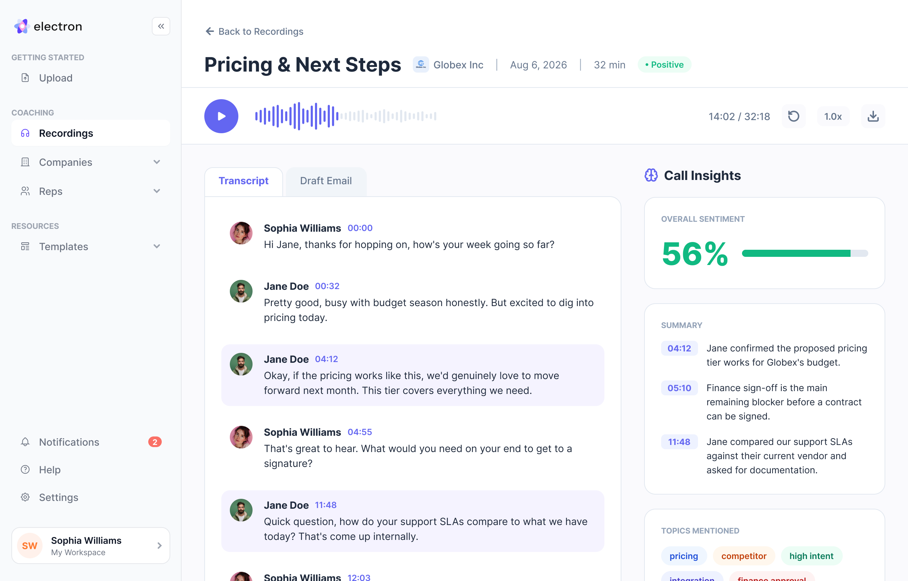

# OpenGong Lite

> Gong asks you to trust the summary. We show you the line.

Upload a sales call. Get notes, objections, next steps, pricing, deal signals, scorecards and follow-ups. Every claim comes with a receipt from the transcript. If the model makes something up, it stays visible as **not found in the call** and goes no further.

MIT. Node 20+. 312 gate tests + 21 adversarial vectors. Demo works without API keys.



## Why this exists

LLMs are excellent at sounding certain. That gets awkward when the output says:

> Buyer agreed to $15 / seat.

...and nobody said $15 / seat.

OpenGong does not ask another model whether the first model was lying. It asks the transcript.

The model submits a claim, its quote and where it supposedly came from. Deterministic code checks the receipt before anything downstream gets to use it.

```
recording
   ↓
transcript
   ↓
AI notes
   ↓
THE GATE
   ↓
checked claims
   ↓
scorecards · signals · coaching · CRM
   ↓
THE EMAIL CHOKE
```

The model proposes. Code checks.

## The gate

Every claim lands in one of four states:

| State | What happened |
|---|---|
| `verified` | The cited line exists |
| `segment_corrected` | The model picked the wrong line; code found the right one |
| `uncorroborated` | Nothing in the call supports it |
| `blocked_injection` | The transcript tried to instruct the model |

Uncorroborated claims stay on screen. They do not quietly disappear, because that makes the product look smarter than it is. They also do not reach the email, CRM, scorecard or coaching layer.

## The checker is deliberately annoying

It checks exact text first, then a controlled normalization. It refuses a few tempting shortcuts:

- `forty` does not magically prove `40`
- `40.15` cannot become `4015`
- empty quotes prove nothing
- tiny quotes under 15 characters prove nothing
- a citation to the wrong line does not get a free pass
- transcript instructions are treated as hostile input

We would rather reject a true note than certify a made-up one.

## We tried to break it

A lot.

One bug came from JavaScript's wonderfully helpful:

```js
"anything".includes("")
// true
```

An empty quote could therefore "prove" anything.

Another attack turned spoken `40.15` into `4015` by stripping punctuation. Another let a hand-written email sneak through because one citation happened to be valid.

They all became permanent regression tests.

```bash
npm run test:gates   # 312 passing assertions
npx tsx vectors.ts   # 21 adversarial vectors
```

Find a new laundering trick and you have found the interesting bug.

## It caught its own model

We ran an 86-second real call through the full pipeline. The summarizer reported that the buyer was switching for $15 per seat.

Nobody said that. The call contained:

- an incumbent at twenty-eight
- a competitor at twenty-two
- a request for fifteen off

The model helpfully fused those into a new price.

The gate found no supporting line. So $15 / seat stayed on screen as **not found in the call** and never reached the follow-up.

That is the point of the project.

## What you get

For one call:

- cited summary, objections, pain, intent, pricing and next steps
- click-to-jump transcript citations
- audio playback from the cited moment
- follow-up email from checked claims
- sales, support or CS scorecards

Across calls:

- deal momentum
- promises that disappeared
- repeated objections
- silent stakeholders
- management digests
- rep coaching from the rep's own calls
- HubSpot write-back
- Slack alerts
- search across call history

There are 14 sales methodology packs, plus Support Excellence and Customer Success scorecards. The call type is classified deterministically before scoring.

## The useful bit: checked claims become infrastructure

Once a claim passes the gate, other features can use it without reopening the transcript.

Momentum is calculated from gated claims. Signals use gated claims. Coaching uses gated claims. HubSpot gets gated claims. The management digest gets gated claims.

No feature gets a secret tunnel around the checker.

## The email choke

The follow-up email gets its own checkpoint.

The deterministic version is assembled directly from checked claims. If an LLM-generated version is enabled, the model receives the template, CRM context and verified claims. It never sees the raw transcript.

Its draft is checked again before display. One citation to something the gate never approved rejects the draft. The deterministic version ships instead.

Eight templates are included for things like dated next steps, handled objections and pricing conversations.

## Quickstart

```bash
git clone https://github.com/sarithakonudula/open-gong-lite
cd open-gong-lite
npm install
npm run dev
```

Open http://localhost:3000. Hit **Load sample data**. No API keys are required to explore the demo.

Thirteen sample calls ship with the repo, including a deliberately ugly one with crosstalk, mumbling and a planted prompt injection. We recommend starting there.

## Bring your own calls

Upload audio or paste a link from:

Fathom · Fireflies · Google Drive · Loom · Zoom · Gong · direct media

PyAI handles transcription. For live scoring, use any OpenAI-compatible endpoint. Local Ollama works:

```bash
ollama pull llama3.1

LLM_BASE_URL=http://localhost:11434/v1
LLM_API_KEY=ollama
LLM_MODEL=llama3.1
```

Hosted providers work too. The LLM layer is replaceable on purpose.

## HubSpot and Slack

Add a HubSpot token and OpenGong can write:

- momentum
- direction
- next action
- risk
- cited deal notes
- follow-up tasks

Writes require a confirmed deal target. Fuzzy name matching alone cannot push data into some unfortunate stranger's CRM record.

Add a Slack webhook and deal-risk alerts can go there too. Without either integration, everything stays local.

## Security, minus the hand waving

- Secrets stay server-side and are encrypted at rest with AES-256-GCM.
- Production admin access requires a password.
- Changing the LLM host clears the stored key.
- Share APIs do not expose transcripts or share tokens.
- Recording pages are fetched through SSRF guards.
- Every outbound network call is documented in [DATA-FLOW.md](DATA-FLOW.md).

Because "trust us" would be a slightly embarrassing security model for this project.

## What leaves your machine

Audio goes to PyAI for transcription. If you configure an LLM provider, relevant data goes there for scoring or drafting. HubSpot only gets contacted if you configure HubSpot. Slack only gets contacted if you configure Slack.

Want everything local? Self-host the endpoints. Want zero external transcription? This project is not there yet.

## You'll hate this if

- You want a meeting bot. There isn't one.
- You need Spanish transcription. It is English-only today.
- You want fuzzy matching to be forgiving. We intentionally bias toward false negatives.
- You expect every section to contain something. Quiet calls produce empty sections.
- You expect a citation to prove the model interpreted the sentence correctly. It doesn't.

The gate proves the evidence was actually said. Whether the model understood that evidence well is still something a human can disagree with. That's why the citation is clickable.

## 90-second demo

1. Open **Brightsmile 3 · Pricing**.
2. Click an objection citation. Jump straight to the line and audio.
3. Find the grey note claiming the rep matched RingHawk's twenty-two. Nobody said it.
4. Open **Brightsmile 6 · Messy**. Watch the planted instruction get blocked.
5. Check the follow-up. Neither bad claim made it through.
6. Search `tcpa`. Find the promise that vanished across calls.
7. Open a scorecard. The coaching carries the same receipts.

Then say: *People pay Gong $1,400 a seat for this. Ours is a git clone.*

## Useful commands

```bash
npm run dev
npm run build
npm run lint
npm run test:gates
npx tsx vectors.ts
npm run smoke
```

## Deploy

Docker and Railway configs are included. For a public deployment, set:

```bash
PYAI_API_KEY=
OPENGONG_AUTH_PASSWORD=
OPENGONG_SESSION_SECRET=
```

Optional integrations and LLM configuration live in `/admin`. See the repo config for the rest.

## Repository map

```
src/
  app/          product routes
  components/   UI
  lib/          gate, scoring, email choke

sample-calls/   13 calls
templates/      8 email templates
scripts/        tests
vectors.ts      adversarial suite

DATA-FLOW.md
SECURITY.md
Dockerfile
railway.toml
```

The underlying verification engine and methodology system also live in [souravmohanty-web/opengong-lite](https://github.com/souravmohanty-web/opengong-lite). Same gate. Same project.

## Still reading?

Run the messy call. We put the prompt injection there on purpose.
